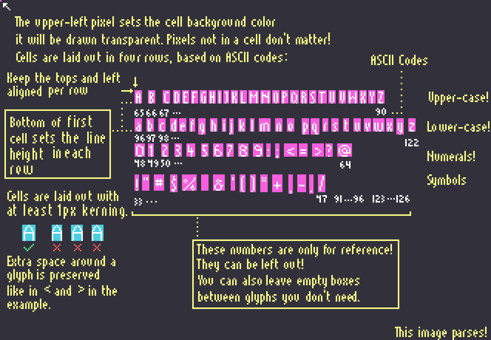

# ingenten


A dead-simple pixel font library in Go, written for compatibility with [Ebitengine](https://ebitengine.org).

## Features:

* Simple pixel font format for ASCII characters, relying only on image data.
* Pluggable layout function for your own animations / effects. 

## Usage

1) Draw your pixel font, following the infographic below carefully. This infographic is also a test image used by this
   library.



2) Import in your project:
```shell
go get github.com/FrabjousStudios/ingenten
```

3) Parse the font... (you probably want to [embed](https://pkg.go.dev/embed) it, right?)
```go
type Game struct {
	font *ingenten.PixelFont
}

g.font, err := ingenten.LoadPixelFont("pixel_font.png", os.DirFS("."))
if err != nil {
	log.Fatal("no font for you today! :(", err)
}
```

4) Profit!
```go
func (g *Game) Draw(screen *screen) {
	pos := image.Pt(30, 30)
	text := "Hello world!"
	measured := g.font.Measure(text)
	log.Println("drawing text to rect:", measured.Add(pos))
	
	g.font.PrintTo(screen, pos, text)
}
```

## Developing / Testing Fonts

To test, `cd internal` and execute `go run main.go`. The demo scene requires you to type a few things in order to
test the font. You can instead modify `initial_text.txt` in with as much or as little text as you'd like, to cut down on
typing.

Planned features:
* [ ] Word-wrapping text so that it fits in a given `image.Rectangle`.
* [ ] Centered text.
* [ ] Right-justified text.
* [ ] Better kerning logic (take the maximum of left and right glyph instead of adding).

Pull requests are welcome.

### Why "Ingenten"?

Because I convinced myself that it's Japanese for 'green bean tempura' and also 'ingredient' and I thought that might be
a clever pun. Is it? I don't really know Japanese. 

Anyway, Ebitengine was originally called 'Ebiten' which is the romanification of 'shrimp tempura'. 'Ingen' is Japanese
for 'haricots' or 'green beans' and '-ten' is a suffix sometimes added to tempura dishes. 'Ingenten' is also
'ingredient', which I think describes the intent for this library pretty well... it provides a small, but important part
of the recipe for drawing Pixel Fonts. 